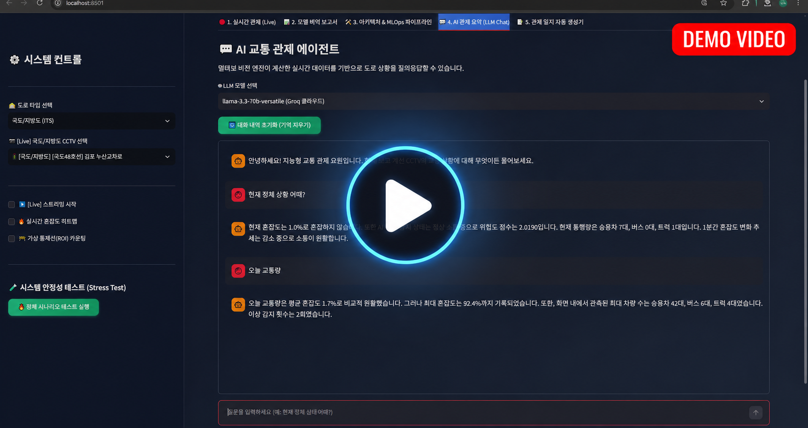
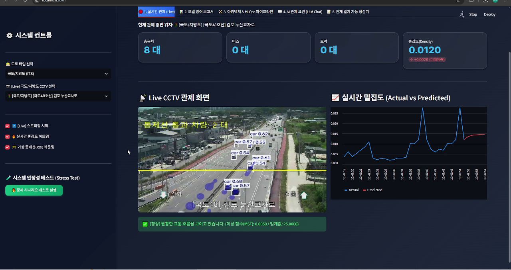
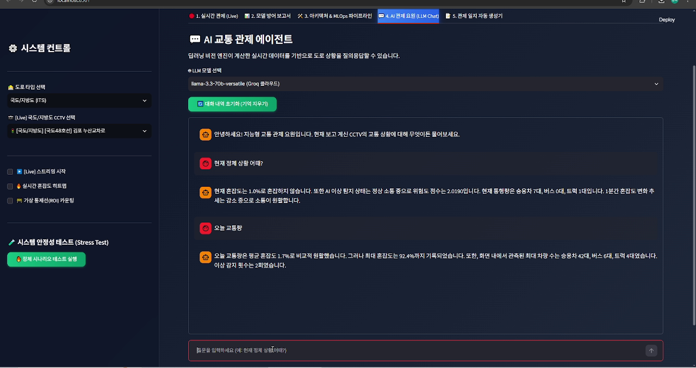
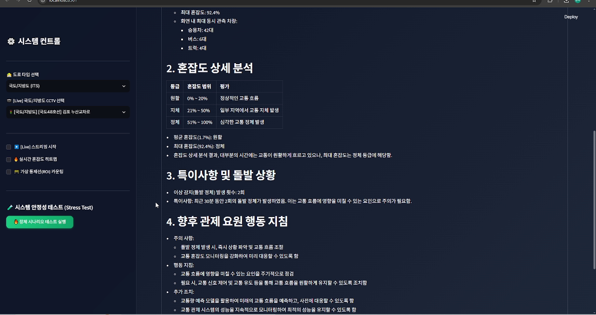
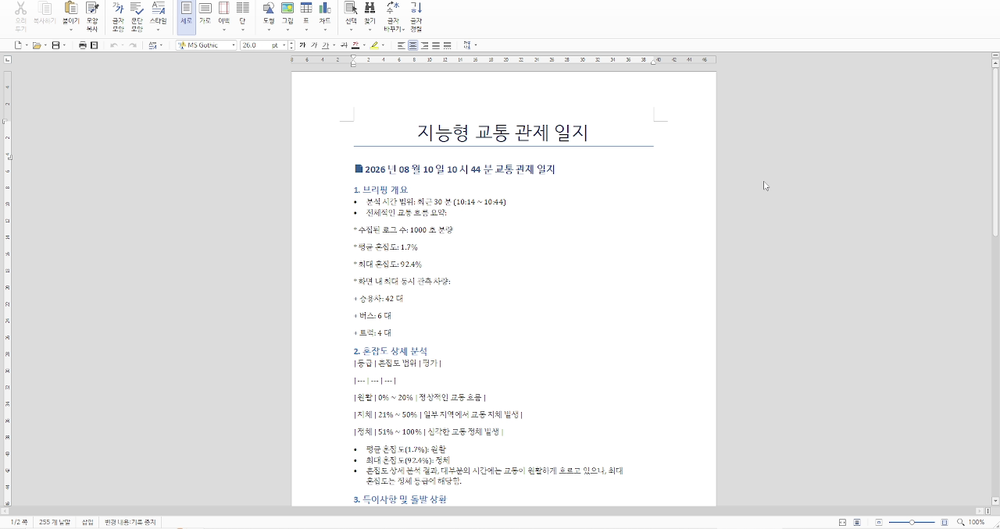
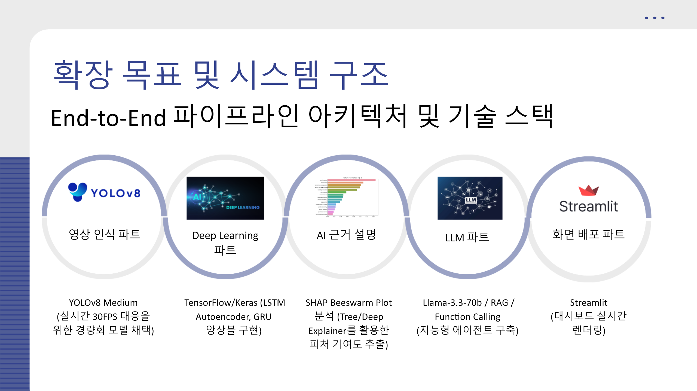
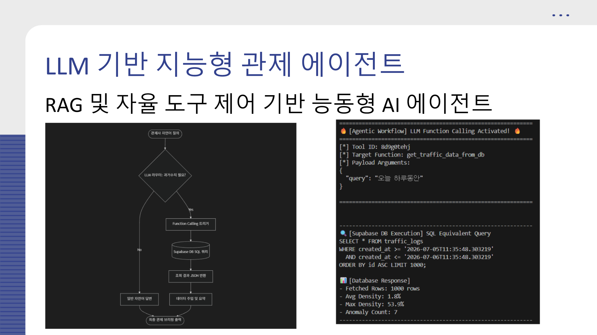

# Vision-to-Text 지능형 고속도로 관제 대시보드

실시간 CCTV 비전 분석과 시계열 예측 결과를 LLM에 연결해 자연어 교통 브리핑과 관제 일지를 생성하는 개인 LLM 프로젝트입니다. 딥러닝 관제 파이프라인에 대화형 분석, 과거 데이터 조회, 보고서 자동화를 추가한 통합 시스템입니다.

## 시연 영상

[](https://youtu.be/dR177JPcxXM)

## 실행 화면

### 실시간 Vision AI 관제



### AI 교통 관제 에이전트



### 관제 일지 자동 생성



### Word 보고서 출력



## 핵심 설계

### Vision-to-Text 통합 아키텍처



YOLOv8 차량 탐지, LSTM Autoencoder 이상 탐지, GRU 교통량 예측, SHAP 설명, Llama 기반 응답 생성을 하나의 파이프라인으로 연결했습니다. 영상에서 얻은 수치가 자연어 브리핑과 관제 보고서로 변환되는 전체 흐름을 보여줍니다.

### RAG와 Function Calling



사용자의 자연어 질문에서 기간과 조회 의도를 파악하고, 필요한 경우 Function Calling으로 Supabase의 실제 데이터를 조회합니다. 조회 결과를 현재 관제 지표와 결합해 근거가 있는 답변을 생성하도록 설계했습니다.

## 핵심 기능

- YOLOv8 기반 실시간 차량 탐지 및 차종별 집계
- LSTM Autoencoder 기반 이상 교통 패턴 탐지
- GRU 기반 단기 교통량 예측
- Supabase 실시간 로그 저장 및 기간별 통계 조회
- Groq Llama 기반 AI 교통 관제 에이전트
- 현재 관제 지표와 최근 DB 통계를 결합한 컨텍스트 주입
- 자연어 시간 범위를 해석한 과거 교통 데이터 조회
- 최근 10분·30분·1시간 기준 관제 일지 자동 생성
- 생성 결과를 Word 문서로 다운로드
- Groq 장애에 대비한 로컬 Ollama 연결 확장 구조

## 시스템 흐름

```text
CCTV/영상
   ↓
YOLOv8 차량 탐지·추적
   ↓
밀집도·차종별 통행량 산출
   ├── LSTM Autoencoder 이상 탐지
   ├── GRU 미래 교통량 예측
   └── Supabase 로그 저장
              ↓
      기간별 데이터 조회
              ↓
Groq Llama 관제 에이전트
   ├── 자연어 질의응답
   └── 관제 일지·Word 보고서 생성
```

## 기술 스택

- Python, Streamlit
- Groq API, Llama 3.3
- OpenCV, Ultralytics YOLOv8
- TensorFlow/Keras
- Supabase
- pandas, NumPy, scikit-learn
- python-docx
- Matplotlib, Seaborn

## 프로젝트 구조

```text
LLM/
├── app.py                              # Vision·예측·LLM 통합 대시보드
├── notebooks/
│   ├── End_to_End_Master_Pipeline.ipynb
│   ├── Vision_Benchmark.ipynb
│   └── Forecasting_Benchmark.ipynb
├── models/                             # 탐지·이상탐지·예측 모델
├── yolov8m.pt                          # 객체 탐지 가중치
├── requirements.txt
├── PROGRESS.md                         # 구현 및 트러블슈팅 기록
└── 최종_프레젠테이션_대본.md
```

## 환경 변수

루트에 `.env`를 만들고 아래 값을 입력합니다. 실제 키는 절대 Git에 커밋하지 마세요.

```dotenv
ITS_API_KEY=your_its_api_key
SUPABASE_URL=your_supabase_url
SUPABASE_KEY=your_supabase_key
GROQ_API_KEY=your_groq_api_key
```

## 설치 및 실행

```bash
python -m venv .venv
.venv\Scripts\activate
pip install -r requirements.txt
streamlit run app.py
```

애플리케이션 실행 전 `models/`의 모델 파일과 `.env` 설정을 확인하세요. GPU가 없으면 TensorFlow와 YOLO 추론 속도가 크게 느려질 수 있습니다.

## 주요 화면

- 실시간 관제: CCTV 영상, 차량 탐지, 혼잡도와 이상 경보
- 미래 예측: 실제 교통량과 GRU 예측값 비교
- 모델 방어: 선택한 비전·시계열 모델의 평가 근거
- MLOps/분석: Supabase 적재 구조와 누적 데이터 분석
- AI 관제 에이전트: 현재·과거 교통 상황에 대한 자연어 질의응답
- 관제 일지: 기간별 데이터를 요약한 보고서 생성 및 Word 다운로드

## 노트북 구성

- `Vision_Benchmark.ipynb`: YOLOv8, RT-DETR, Faster R-CNN의 주·야간 탐지 성능과 임계값 비교
- `Forecasting_Benchmark.ipynb`: LSTM, 1D-CNN, GRU의 MSE·R² 및 예측 결과 비교
- `End_to_End_Master_Pipeline.ipynb`: 비전, 이상 탐지, 미래 예측, XAI·LLM 연계 흐름을 통합

## 운영 및 보안 주의사항

- `.env`, API 키, Supabase 서비스 키를 저장소에 커밋하지 마세요.
- LLM 응답은 관제 의사결정을 보조하는 정보이며 실제 사고 판단을 대체하지 않습니다.
- 스트레스 테스트 중 생성되는 가상 데이터가 운영 통계에 섞이지 않도록 DB 적재 차단 상태를 확인하세요.
- 공공 CCTV와 외부 LLM API의 장애·호출 제한에 대비한 타임아웃과 폴백 처리가 필요합니다.
- 관제 일지에 개인정보나 민감한 운영 정보가 포함되지 않도록 출력 전 검토하세요.

## 향후 개선 방향

- LLM 도구 호출 스키마와 시간 범위 파서의 자동 테스트
- 모델·프롬프트·데이터 버전 추적
- 영상 추론, DB 적재, LLM 요청의 서비스 분리
- 근거 데이터 링크와 신뢰도 표시를 포함한 설명 가능한 보고서
- 운영 장애와 API 한도에 대한 모니터링 및 재시도 정책 강화
